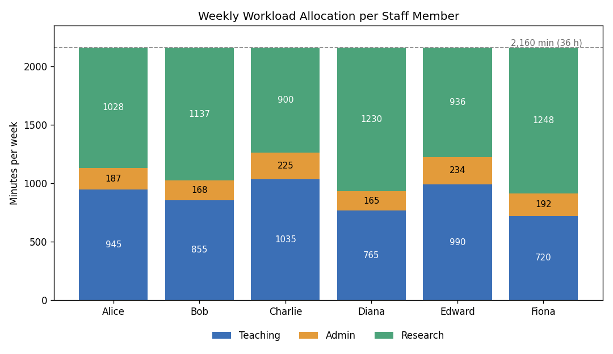

# University Workload Optimiser

A **Constraint Satisfaction Problem (CSP)** solution that automatically allocates teaching, administration and supervision duties to university staff. Built with **Google OR-Tools CP-SAT** in Python, it assigns module leaders, practical groups and student supervisors while respecting contractual limits and balancing four strategic goals: **fairness, efficiency, teaching quality and research time**.

This project was completed as university coursework.

## The Problem

Each week, a department has to decide:
- **who leads each module**, which brings lectures and extra admin
- **who teaches each practical group**
- **who supervises each final-year student**

Every staff member works a fixed number of hours, which must be split between teaching, admin and research within set limits. Doing this by hand is slow and often unfair. This optimiser finds a valid allocation automatically.

## How It Works

The problem is modelled as a **Constraint Satisfaction Problem (CSP)**: decision variables, hard constraints that every valid allocation must satisfy, and soft constraints that rank the valid allocations. It is solved with the CP-SAT solver from Google OR-Tools.

### Decision Variables
- `module_leader[staff, module]`: whether a staff member leads a module
- `practical_assignment[staff, module, group]`: whether a staff member teaches a practical group
- `supervision[staff, student]`: whether a staff member supervises a student

### Hard Constraints
- Every module has exactly **one leader**, who must meet a minimum skill level
- Each staff member can lead only a limited number of modules
- Every practical group has exactly **one tutor**, and each module has **at most 3 tutors**
- A module leader must teach **at least one practical** of their own module
- Every student has exactly **one supervisor**, with a cap on students per staff member
- Teaching and admin time must stay within contractual minimums and maximums
- Every staff member gets a **minimum amount of research time**

### Workload Calculation
- **Teaching:** delivery time plus preparation time. Preparation increases when the staff member's skill level for the module is lower.
- **Admin:** a base amount, plus leadership admin proportional to student numbers, plus admin per practical group.
- **Research:** whatever remains of the weekly total after teaching and admin.

### Strategic Goals (Soft Constraints)
| Goal | How it is measured |
|---|---|
| **Fairness** | Difference between the highest and lowest total workload |
| **Quality** | Penalties when a leader isn't the most skilled, when a tutor is more skilled than the leader, or when practicals aren't taught by the leader |
| **Efficiency** | Number of different modules each staff member works on, since fewer modules means less context switching |
| **Research** | Total research time across all staff (maximised) |

These goals are combined into a **weighted objective**. Two strategies are implemented:
- **Baseline balanced:** `10×Fairness + 5×Quality + 2×Efficiency − Research`
- **Prioritised:** fairness and quality weighted much more heavily than efficiency and research

A **search strategy** guides the solver to decide module leaders first, then practical groups, then supervision, since the earlier decisions have the biggest impact on the rest.

## Results

The solver found an **optimal** allocation. Every staff member works exactly **2,160 minutes (36 hours)** per week, split as follows:



| Staff | Teaching | Admin | Research | Total |
|---|---|---|---|---|
| Alice | 945 | 187 | 1,028 | 2,160 |
| Bob | 855 | 168 | 1,137 | 2,160 |
| Charlie | 1,035 | 225 | 900 | 2,160 |
| Diana | 765 | 165 | 1,230 | 2,160 |
| Edward | 990 | 234 | 936 | 2,160 |
| Fiona | 720 | 192 | 1,248 | 2,160 |

**Module leaders:** Module 1 → Charlie, Module 2 → Bob, Module 3 → Fiona, Module 4 → Alice, Module 5 → Edward

Key outcomes:
- All hard constraints were satisfied, and every staff member met the minimum research time of 900 minutes (15 hours).
- Each module leader teaches most of their own module's practical groups, which keeps teaching consistent.
- Most staff work on only **one module**. Diana is the exception: she has no leadership role and fills gaps across Modules 1 and 5.
- Staff with lighter teaching loads (Diana and Fiona) get the most research time.

The full allocation, including practical groups and supervision assignments, is in [`allocation.json`](allocation.json).

### Solver Performance Under Time Pressure
| Time limit | Solver status |
|---|---|
| 30 s | Optimal |
| 2 s | Optimal |
| 1 s | Optimal |
| 0.5 s | Feasible (valid, but not proven optimal) |

The model is small and well-structured enough to be solved to optimality in about a second.

## Trade-offs Observed
- **Fairness vs efficiency:** balancing workloads sometimes means giving a staff member practicals in a second module.
- **Teaching vs research:** staff with heavier teaching loads, especially module leaders, have less time left for research.

## Repository Files
| File | Description |
|---|---|
| `optimiser.py` | CP-SAT model: decision variables, constraints, objectives, search strategy and solution extraction |
| `allocation.json` | Output allocation produced by the solver |
| `workload_allocation.png` | Chart of the final workload per staff member |

## How to Run

The optimiser relies on an `interface.py` module and on instance and configuration JSON files that were supplied with the coursework, so they are not included here.

```bash
pip install ortools
python optimiser.py --instance instance.json --config config.json --out allocation.json
```

## Tech Stack
Python · Google OR-Tools (CP-SAT) · Constraint Satisfaction · Multi-objective Optimisation
